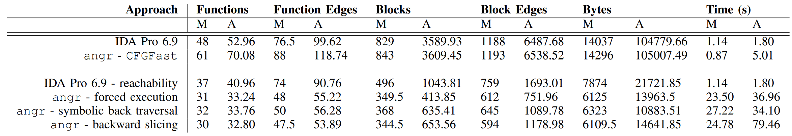
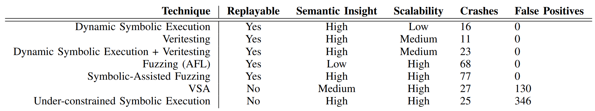

# 🎨 The Art of War
> (State of) The Art of War:
Offensive Techniques in Binary Analysis 논문 내용 정리

# Category
- [🎨 The Art of War](#-the-art-of-war)
- [Category](#category)
  - [AUTOMATED BINARY ANALYSIS](#automated-binary-analysis)
    - [Trade-offs](#trade-offs)
  - [BACKGROUND: STATIC VULNERABILITY DISCOVERY](#background-static-vulnerability-discovery)
    - [Recovering Control Flow](#recovering-control-flow)
    - [Vulnerability Detection with Flow Modeling](#vulnerability-detection-with-flow-modeling)
    - [Vulnerability Detection with Data Modeling](#vulnerability-detection-with-data-modeling)
  - [BACKGROUND: DYNAMIC VULNERABILITY DISCOVERY](#background-dynamic-vulnerability-discovery)
    - [Dynamic Concrete Execution](#dynamic-concrete-execution)
  - [BACKGROUND: EXPLOITATION](#background-exploitation)
    - [Crash Reproduction](#crash-reproduction)
  - [ANALYSIS ENGINE](#analysis-engine)
    - [Design Goals](#design-goals)
    - [Submodule: Intermediate Representation](#submodule-intermediate-representation)
    - [Submodule: Binary Loading](#submodule-binary-loading)
    - [Submodule: Program State Representation/Modification](#submodule-program-state-representationmodification)
    - [Submodule: Data Model](#submodule-data-model)
    - [Submodule: Full-Program Analysis](#submodule-full-program-analysis)
  - [IMPLEMENTATION: CFG RECOVERY](#implementation-cfg-recovery)
    - [Assumptions](#assumptions)
    - [Iterative CFG Generation](#iterative-cfg-generation)
    - [Forced Execution](#forced-execution)
    - [Symbolic Execution](#symbolic-execution)
    - [Backward Slicing](#backward-slicing)
    - [CFGFast](#cfgfast)
  - [IMPLEMENTATION: VALUE SET ANALYSIS](#implementation-value-set-analysis)
    - [Using VSA](#using-vsa)
  - [IMPLEMENTATION: DYNAMIC SYMBOLIC EXECUTION](#implementation-dynamic-symbolic-execution)
  - [IMPLEMENTATION: UNDER-CONSTRAINED SYMBOLIC EXECUTION](#implementation-under-constrained-symbolic-execution)
  - [IMPLEMENTATION: SYMBOLIC-ASSISTED FUZZING](#implementation-symbolic-assisted-fuzzing)
  - [COMPARATIVE EVALUATION](#comparative-evaluation)

## AUTOMATED BINARY ANALYSIS
### Trade-offs
offensive binary analysis는 실현 가능성을 위하여 이론적인 절충안을 내놓아야 하는데, 이는 다음과 같다.

**Replayability.** 취약점을 trigger 하고, crash를 replay 할 수 있느냐

**Semantic Insight.** input의 어떤 부분이 application의 행동을 결정하는지에 대한 의미론적인 통찰력이 있느냐

`replayability`는 low coverage와 관련이 있다. replay를 위해서는 해당 코드까지 어떻게 도달하느냐에 대한 이해가 필요하며, 이는 replay를 신경쓰지 않는 analysis 보다 더 많은 코드를 분석할 수는 없음을 의미한다.

`semantic insight`를 위해서는 많은 양의 data를 저장해야 한다. 이는 환경을 modeling 해야 하는데, 즉 예를 들어 수 많은 system call의 영향을 modeling 해야 하는 복잡성이 존재한다.

```c
1 int main(void) {
2 char buf[32];
3
4 char *data = read_string();
5 unsigned int magic = read_number();
6
7 // difficult check for fuzzing
8 if (magic == 0x31337987) {
9 // buffer overflow
10      memcpy(buf, data, 100);
11 }
12
13 if (magic < 100 && magic % 15 == 2 &&
14 magic % 11 == 6) {
15 // Only solution is 17; safe
16      memcpy(buf, data, magic);
17 }
18
19 // Symbolic execution will suffer from
20 // path explosion
21 int count = 0;
22 for (int i = 0; i < 100; i++) {
23      if (data[i] == 'Z') {
24          count++;
25      }
26 }
27
28 if (count >= 8 && count <= 16) {
29 // buffer overflow
30      memcpy(buf, data, count*20);
31 }
32
33 return 0;
34 }
```
---
**Listing 1: An example where different techniques will report different bugs.**

- 16번째 줄은 `magic`이 17만 될 수 있기 때문에 buffer overflow가 발생하지 않는다, 하지만 static analysis technique는 10, 16, 30번째 줄의 `memcpy`를 모두 potential bug로 보고할 것이다.
- simple fuzzing technique는 30번째 줄의 `memcpy`의 buffer overflow를 보고할 것이다.
- dynamic symbolic execution은 10번째 줄의 `memcpy`를 buffer overflow로 보고하고, 22번째 줄에서 너무나도 많은 잠재적인 경로 때문에 path explosion이 발생할 것이다.

## BACKGROUND: STATIC VULNERABILITY DISCOVERY
static vulnerability identification technique는 [Trade-offs](#trade-offs)와 관련된 두 가지 결함이 존재한다.
- 결과가 replayable하지 않다.
- semantic insight를 줄이는 simpler data domain를 사용하는 경향이 있다. 짧게 말해서, 과대평가한다(false positive)

### Recovering Control Flow
CFG에서는 다음과 같은 용어가 존재한다.
- node: basic blocks of instructions
- edge: possible control flow between node

CFG Recovery에는 필수적이고 기초적인 challenge가 존재하는데, 이는 indirect jump이다.
indirect jump는 여러 가지 종류로 나뉘는데, 이는 다음과 같다.

**Computed.** 코드에 명시되어 있는 계산을 수행함으로써 indirect jump를 계산하는 것이다.

**Context-sensitive.** 앱의 context에 따라 indirect jump가 계산되는 방식이며, 예로는 c언어의 `qsort()`가 있다.

**Object-sensitive.** oop의 다형성에서, virtual function같이 object에 따라 indirect jump가 계산되는 방식이다.

위와 같은 각기 다른 종류들의 indirect jump를 위해 각기 다른 technique를 사용한다.
얼마나 jump target이 잘 resolve 됐냐를 표현하는 두 가지 속성이 존재한다.

**Soundness.** 잠재적인 control flow transfer가 모두 resolve 됐을 때, 이를 sound하다 라고 말한다. (true positive rate of indirect jump)

**Completeness.** 모든 edge가 실제로 가능한 control flow tranfer를 표현하는 CFG를 complete 하다고 한다. (false positive rate of indirect jump)

이상적인 형태는 `Soundness`와 `Completeness` 사이의 어딘가일 것이다.

### Vulnerability Detection with Flow Modeling
program property graph 분석을 통해 약간의 취약점을 발견할 수 있다.

**Graph-based vulnerability discovery.** program property grpah는 control-flow graph, data-flow-grpah, control-dependence graph 등이 있다.
이는 이미 발견된 취약점과 동일한 코드를 식별하는 데에 초점이 맞춰져 있다. 이러한 기술과는 달리, 여기서 원하는 것은 새로운 취약점을 식별하는 것이다.

### Vulnerability Detection with Data Modeling
static anlaysis는 앱이 계산하는 data를 추적할 수 있다.

**Value-Set Analysis.** VSA는 특정 지정메서 memory 혹은 register에 들어 있는 value에 대해 과근사치를 식별하려고 시도한다. 이를 통해 indirect jump의 possible target과 memory write operation의 possible target을 이해할 수 있다. 정확도는 조금 떨어지지만 이는 sound하다. (never under-approximate)
이렇게 recover된 variable과 buffer location은 취약점을 식별하기 위해 사용된다. (overlapping)

## BACKGROUND: DYNAMIC VULNERABILITY DISCOVERY
동적 분석은 replayable 하지만 semantic insight 측면에서 많은 input을 생성하게 된다.

### Dynamic Concrete Execution
이러한 분석은 댠일 경로 수준에서 작동하는데, 예를 들어 특정 input을 주었을 때 어떤 경로가 선택되느냐에 대한 분석이다. 때문에 dynamic concrete execution은 사용자가 제공하는 test case가 필요하다는 문제점이 존재한다.
*1) Fuzzing*: dynamic concrete execution에 가장 적합한 앱은 fuzzer다. 때문에 이도 동일하게 test case가 필요하다는 문제점을 갖고 있다.

**Coverage-based fuzzing.** 위와 같은 test case의 문제점은 coverage와 함께한다면 부분적으로 완화된다. coverage-based fuzzer는 coverage를 기반으로 얼마나 많은 코드가 실행되었느냐를 측정하여 더욱 많은 코드를 실행시키는 input을 생성하도록 시도한다. AFL이 이와 같다.
coverage based fuzzing은 semantic insight가 부족하여 input의 어느 부분이 해당 코드를 실행시켰는가에 관해 이해할 수 없다는 문제점이 존재한다.

**Taint-based fuzzing.** 이는 향후 실행에서 input이 어느 부분에 영향을 미치느냐에 관환 분석이다. 이는 보통 taint tracking과 data dependency recovery와 같은 static technique을 함께 사용한다. taint-based fuzzing은 input의 어느 부분을 mutate해야 해당 코드로 도달할 수 있는지는 이해할 수 있지만, 어떻게 mutate 해야하는지는 이해할 수 없다는 문제점이 존재한다.
*2) Dynamic Symboic Execution*: 프로그램을 emulated environment에서 실행하는 dynamic technique이다. symbolic variable과 함께 context를 저장하고, 분기를 만나면 양쪽 분기 모두를 저장하여 가능한 경로를 모두 탐색한다.(fork) 이를 통해 특정 경로를 실행하는 input을 생성할 수 있다.

**Classical dynamic symbolic execution.** 현재 제안된 symbolic execution technique들은 모두 *path explosion*의 문제가 존재하여 scalability가 제한된다.
promising path를 우선시하거나 적합한 상황에 path를 merge하여 이를 해결하려는 시도가 존재하였지만 근본적인 dynamic symbolic engine이 이를 극복하지 못하여 이를 통해 발견된 bug들은 대부분 얕은 경로의 bug들이다.

**Symbolic-assisted fuzzing.** fuzzing의 속도적인 장점은 챙기면서, 주요 결함을 완화하는 방식이다. 예를 들어, dynamic symbolic execution을 사용하여 추가적인 탐색되지 않은 test case들을 제공하고, 이를 coverage-based fuzzing과 같은 방식으로 결합하는 방식이다.

**Under-constrained symbolic execution.** dynamic symbolic execution을 앱의 특정 부분에만 적용시키는 방식이다. 이는 두 가지 결함이 존재한다. 해당 부분에 대한 적절한 context를 보장할 수 없다는 것과 static technique과 비슷하게 replaybility를 포기하고 scalability를 취했다는 것이다.

## BACKGROUND: EXPLOITATION
앞서 있었던 기술들은 모두 crashing input을 찾는 기술이었고, 여기서는 이들을 분류하여 reproduce하고, AEG하는 방식에 대하여 알아본다.

### Crash Reproduction
대부분의 취약점 분석은 테스트 환경에서 시행된다. 예를 들면, 대부분의 fuzzer는 환경을 de-randomization 한다. 즉, 소스의 randomization 부분이 hardcoded 되어 있다. 이 때문에 replay가 불가능 할 수 있다.
replayable하지 않은 이유는 일반적으로 두 가지로 나뉜다.

**Missing data.** 실행할 때마다 바뀌는 값이 hardcoded되어 있을 경우 실제 환경에서 crashing input을 실행하면 이는 replay되지 않을 것이다.

**Missing relationships.** 토큰이 프로그램에 의하여 주어지고, 이 토큰을 통해 프로그램 실행시킬 수 있다고 했을 때, 이에 대한 이해가 없다면 적합한 토큰 값을 제공해줄 수 없을 것이다. (즉, replay 불가능)

## ANALYSIS ENGINE
차세대 바이너리 분석 시스템, **angr**에 대하여 설명한다.

### Design Goals
- **Cross-architecture support.**
- **Cross-platform support.**
- **Support for different analysis paradigms.**
- **Usability.**

### Submodule: Intermediate Representation
여러 architecture를 지원하기 위하여 `IR`을 사용하며, libVEX를 python으로 포팅한 pyVEX를 사용한다. 

### Submodule: Binary Loading
바이너리 로딩은 `CLE`라는 모듈에 의해서 수행된다. 주어진 바이너리와 라이브러리를 모두 다루며, dynamic symbol을 resolve하고 relocation을 수행하며 program state를 초기화시킨다.

### Submodule: Program State Representation/Modification
*program state*는 레지스터, 메모리, 열린 파일 등의 snapshot 정보를 갖고 있다. `SimuVEX` 용어로 state는 `SimState`라고 부르며 이를 통해 program state를 조작할 수 있다. 다양한 플러그인들이 존재하는데, 이는 다음과 같다.

**Registers.** `SimuVEX`는 어떤 지점에서든 상응하는 program state에서 레지스터의 값을 추적할 수 있다.

**Symbolic memory.** symbolic execution을 위해 Mayhem의 indexed symbolic memory를 구현하였다.

**Abstract memory.** static analyses에 사용되는 memory model이며, symbolic memory와 달리 대부분의 static analyses에서 사용되는 region-based memory model을 구현하였다.

**POSIX.** POSIX 기반의 바이너리를 분석할 시 `SimuVEX`는 열린 파일 목록과 같은 *system state*를 추적한다.

**Log.** state에 수행된 모든 작업을 기록한다.

**Inspection.** symbolic condition, complex condition, taint, exact expression 등의 breakpoint를 걸 수 있는 강력한 디버깅 툴이다. 심지어 `SimuVEX`의 행동을 바꿀 수도 있다.

**Solver.** `Claripy`와 같은 data model provider를 통해 interface를 다른 data domain으로 변경하게 해준다. 이 모듈이 *symbolic* 모드로 설정되면 registers, memory, file 등을 symbolic하게 바꿔 추적한다.

**Architecture.** `archinfo` 모듈로부터 분석에 유용한 architecture 정보들을 제공해준다.

게다가, `SimuVEX`는 block이라는 기본 단위로 분석을 진행하는데, 이러한 block of code를 `SimuVEX` 용어로 `SimRun`이라고 부른다. `SimuVEX`는 block of VEX-reprensented code를 `SimRun`을 통해 수정하고, 조건 분기의 경우 여러가지 output이 나오도록 처리해준다.

### Submodule: Data Model
`SimState`에 저장된 데이터들은 추상화되어 표현되는데, 이는 `Claripy`라는 모듈에 의해서 수행된다.
어느 지점에서든 expression은 `Claripy`의 backends를 통해 data domain으로 변경될 수 있다. 또, `Claripy`의 frontends를 통해 symbolic expression을 python primitives로 해석시킬 수 있다. 다음과 같은 다양한 frontends가 존재한다.

**FullFrontend.** user에게 z3 backend를 이용하여 symbolic solving, tracking constraints 등을 제공한다.

**CompositeFrontend.** KLEE와 Mayhem에 따르면 constraint를 독립적인 set으로 분리시켰을 때 solver에서의 부하가 준다고 한다. `CompsiteFrontend`는 이를 위해 투명한 interface를 제공한다.

**LightFrontend.** constraint tracking을 지원하지 않고 VSA backend를 이용하여 VSA domaion만을 지원한다.

**ReplacementFrontend.** `LightFrontend`를 확장하여 VSA 값에 대한 *constraints* 지원을 추가한 것이다. 이를 통해 VSA의 과근사치 값에 대한 더욱 정확한 값을 도출해낼 수 있다.

**HybridFrontend.** 빠른 근사치 도출을 위해 `FullFrontend`와 `ReplacementFrontend`를 합친 것이다. 연구학계에서 angr가 처음으로 제안한 방식이라네요.

### Submodule: Full-Program Analysis
`Project`를 통해 submodules를 포함한 모든 기능을 사용할 수 있다.
dynamic symbolic execution을 본격적으로 수행하기 위하여 두 개의 main interface가 존재하는데, 이는 다음과 같다.

**Path Groups.** split, merge하는 경로의 hierarchy를 추적하고, 어떤 경로가 흥미롭고 어떤 경로가 not promising한지를 이해하여 이를 terminate한다.

**Analyses.** `Analysis` 클래스를 통해 `static analyses`와 `dynamic anlayses`의 lifecycle을 관리한다.

## IMPLEMENTATION: CFG RECOVERY
### Assumptions
`CFGAaccurate`는 알고리즘 실행 시간을 최적화하기 위하여 다음과 같이 바이너리에 대한 몇가지 가정을 한다.
1) 프로그램 상의 모든 코드는 다른 함수들로 분리될 수 있다.
2) 모든 함수들은 명시적인 call instruction으로 호출되거나 tail jump로 선행된다.(tail jump는 최적화 옵션이며, 이를 통해 재귀 함수의 스택 사용량을 줄일 수 있다.)
3) 어디서 호출되었는지와 무관하게 stack cleanup behavior는 예측이 가능하다. 이를 통해 이미 분석이 완료된 함수를 skip하고, 스택을 balanced 상태로 유지할 수 있다.

위의 가정들은 바이너리가 난독화되지 않고, 일반적인 방법으로 행동하는 것을 필요로 한다. 이 외의 경우, 이러한 가정을 제거하여 cfg recovery를 진행할 수 있지만 run time은 증가하게 된다.

### Iterative CFG Generation
`CFGAccurate`의 목표인 complete와 sound를 위한 딱 맞는 기술이 존재하지 않기 때문에, 이를 위해 여러 가지 기술을 반복적으로 사용한다. 이용 가능한 기술로 처리될 수 있는 indirect jump 혹은 추가될 수 있는 node, edge 등이 존재하지 않는 경우 cfg generation이 종료된다.

### Forced Execution
`CFGAccurate`의 첫 번째 cfg generation 기술로 dynamic forced execution이 사용된다. 이를 통해 모든 branch point에서 양 방향의 conditional branch를 실행하도록 보장할 수 있다. 이 방법은 indirect jump를 해결할 수 없기 때문에 빠르게 basic block들을 처리하여 다음 기술로 넘겨주는 역할을 한다.

### Symbolic Execution
indirect jump를 해결하기 위해 `CFGAccurate`는 여러 경로가 indirect jump의 한 점으로 모이는 *merge point*를 찾거나 block number의 임계치를 찾는다.(경험적으로 8) 여기서 forward symbolic execution과 constraint solver를 이용하여 indirect jump를 해결한다.
`CFGAccurate`는 jump의 가능한 타겟이 256 이하라면 indirect jump가 성공적으로 해결된 것으로 판단한다. 정상적으로 해결되지 않았을 때, 이러한 값은 *unconstrained*이다.

### Backward Slicing
앞선 분석들은 context 정보가 부족하여 여러 indirect jump들을 처리할 수 없다. 만약 함수가 인자로 function pointer를 받고, 이를 indirect jump의 타겟으로 사용한다면 이를 처리할 수 없다는 것이다.(context-insensitive)
backward slicing은 context-sensitive component이다. 예를 들어, *Function A*가 *Function B*와 *Function C*로부터 불릴 경우 slice는 *Function A* 안에 있는 jump의 backward를 확장하고 *Function A*가 두 개의 start node를 포함하게 한다(*Function B*, *Function C*)
그 다음에 symbolic execution을 통해 이 slice를 처리하여 indirect jump를 해결한다.

### CFGFast
높은 code coverage로 빠르게 cfg를 만들어 내는 것이 `CFGFast`의 목표이다. 이는 manual analysis와 automated analysis에 도움이 될 수 있다. `CFGFast`는 다음과 같은 과정을 거친다.

**Function identification.** **ByteWeight**같이 function prologue signature를 하드코딩하여 함수를 인식한다.

**Recursive disassembly.** 인식된 함수에서 direct jump를 복구하기 위하여 사용된다.

**Indirect jump resolution.** jump table identification과 indirect call target resolution을 통해 indirect jump를 경량화하여 해결한다.

## IMPLEMENTATION: VALUE SET ANALYSIS
CFG가 만들어지면 더 심화된 분석이 가능해지는데, 이 중하나가 VSA이다. 이는 Value-Set Abstract domain이라는 추상 도메인을 사용하여 각 프로그램 포인트에서 가능한 값 혹은 위치를 근사한다.
초기 VSA 설계는 real-world에 부합하지 않기 때문에 정확도를 위하여 다음과 같은 개선을 추가하였다.

**Creating a discrete set of strided-intervals.** VSA의 기본적인 데이터 타입은 숫자 집합의 근사치인 strided interval이다. 이 값을 jump의 타겟으로 사용하게 되면 과근사치 때문에 타겟이 될 수 없는 jump를 만들어 unsoundness를 유발한다. 때문에 strided interval set이라는 새로운 데이터 타입을 만들어 K 요소 이상만큼을 strided interval set이 포함할 때 이를 single strided interval로 통합시켜 정확도를 향상시켰다. K는 조정 가능하며, 이 값이 클수록 정확도가 향상되지만 scalability가 하락한다.

**Applying an algebraic solver to path predicates.** strided interval domain에서 작동하는 가벼운 algebraic solver를 통해 Affine-Relation Analysis의 한계를 해결한다. 새로운 path predicate가 포착되면 이를 solve하여 pata predicate와 관련된 변수 값의 범위를 측정한다. 그 후 기존 값과 이 범위를 교차 비교하여 정확도를 향상시킨다.

**Adopting a signedness-agnostic domain.** 기본적으로 모든 값을 singed로 표현하는데, jump 주소가 unsigned인 경우 이는 unsigned 값에 의존하기 때문에 이와 같은 경우를 해결하기 위하여 singedness와 관계 없이 *Wrapped Interval Analysis*처럼 singed와 unsigned를 동시에 사용하도록 domain을 구현하였다.

### Using VSA
`angr`가 제공하는 VSA 분석은 *Value Flow Graph*이다. VFG는 `SimuVEX`를 통해 추상 메모리 layout을 제공하는데, 이는 구체적으로 `SimAbstractMemory`이다. 이와 관련된 메모리 값들은 `Claripy`를 통해 제공된다.

## IMPLEMENTATION: DYNAMIC SYMBOLIC EXECUTION
Mayhem을 기반으로 작성되었다. 각각의 실행 경로들은 `PATH`를 통하여 관리되고, 이는 `PathGroup`에 의하여 관리된다. 

## IMPLEMENTATION: UNDER-CONSTRAINED SYMBOLIC EXECUTION
`UC-KLEE`를 복제하여 `UC-angr`를 만들었다. 이는 분리된 함수에 symbolic execution을 적용하는 기법이며 replayable하지 않고 false positive가 있다. UCSE는 state의 missing context를 *under-contrained*로 tag한다. 이러한 값이 pointer로 사용될 경우 새로운 *under-constrained* region을 만들고 이를 직접적으로 가리키게 한다. 이를 통해 복잡한 분석을 진행할 수 있으며, 모든 값이 under-constrained인 것 처럼 특정 조건에서 이는 false positive로 기록된다. `angr`는 기존 UCSE에 두 가지 기법을 추가하였다.

**Global memory under-constraining.** `UC-KLEE`는 global memory를 under-constrained로 다루지 않는다. 하지만 context에서, 이도 중요한 부분이기 때문에 `angr`는 false positive rate를 낮추기 위하여 모든 global data를 under-constrained로 마크한다.

**Path limiters.** `UC-KLEE`는 기본적으로 under-constrained pointer의 dereference depth를 확인하여 path explosion을 방지한다. `angr`는 이에 추가로 path explosion을 유발하는 함수를 그저 `return`하는 것으로 패치한다.

**False positive filtering.** exploitable하다고 판단된 것을 추가적인 조건을 사용하여 solve하고, 이를 exploit하여 exploitable 여부를 판단하고, 추가 조건을 제외하여 다시 exploitable 여부를 알아보는 어쩌구 저쩌구 블라블라 필터링 기법이다.

## IMPLEMENTATION: SYMBOLIC-ASSISTED FUZZING
이를 구현한 퍼저는 이미 존재하는데, Driller이다. fuzzer로 AFL을 사용하고, symbolic tracer로 `angr`를 사용한다. AFL이 mutation round를 거친 후 새로운 state-transition을 발견하지 못했을 경우 `angr`를 통해 AFL이 *unique*하다고 판단한 모든 경로에 대해 symbolic execution을 진행한다.

## COMPARATIVE EVALUATION

> EVALUATION OF CFGFAST’S AND CFGACCURATE’S RECOVERED CFG VERSUS THE CFG RECOVERED BY IDA PRO. THE MEDIAN NUMBER (M) AND AVERAGE NUMBER (A) OF EACH VALUE ACROSS ALL BINARIES ARE SHOWN.


> EVALUATION RESULTS ACROSS ALL VULNERABILITY DISCOVERY TECHNIQUES.